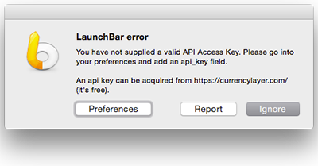

# Convert Currency

Converts all the money you wish you had. Uses [currencylayer.com](currencylayer.com).

It autocompletes your currencies too!

## Installation

You need an API key from [currencylayer.com](currencylayer.com) (it's free).

1. On first run, you will get this prompt:

   
2. Click **Preferences** and open `Preferences.plist`
3. Set `api_key` to your currencylayer api key. By default, it should be set to
   `---API KEY HERE---`.

## Notes
* Rates are cached for 30 minutes, hold down <kbd>ctrl</kbd> to clear your cache and history (might
  be a little slow on first run).
* To access your preferences, hold down <kbd>⌘</kbd> (Command).
