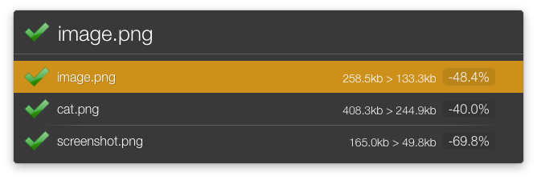

# Optimize Image

Sending files to ImageOptim is easy, but I find the ImageAlpha GUI a tad cumbersome.
This processes your image(s) through ImageAlpha and reports on savings. Works with
multiple images.

Notes:
* Hold down alt to make a copy to optimize rather than operate on the original.
* Hold down shift to also process images through ImageOptim (if available).

Inspired from:

* [My Screenshot action](https://github.com/hlissner/lb6-actions/tree/master/actions/Screenshot.lbaction)
* [Pregnagha's Screenshot action](https://github.com/prenagha/launchbar/tree/master/Screenshot.lbaction)
