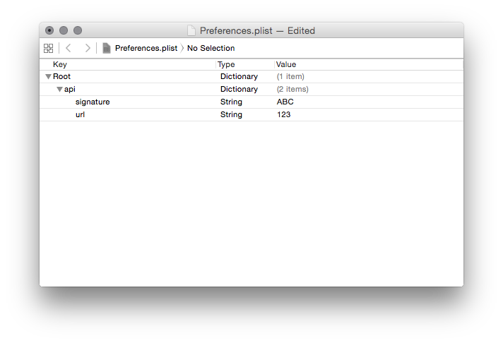

# Shorten URL (YourLS)

Shortens a link using [YourLS](http://yourls.org)!

## Setup

1. Install this action (LB 6+ required):
  * [Download the repo](https://github.com/hlissner/lb6-actions/archive/master.zip)
  * Unzip the downloaded file
  * Double click Shorten URL (YourLS).lbaction to install it

2. Log in to your YourLS website. For instance, mine is at http://v0.io and
   the admin panel is at https://v0.io/admin

3. Go to the **tools** page (e.g. http://v0.io/admin/tools)

4. Scroll down to "Secure passwordless API call" and take note of your
   **security token** and the **URL to your yourls-api.php script**, e.g.
   http://v0.io/yourls-api.php

5. Run the Shorten URL (YourLS) action. You will get a prompt telling you your
   API details aren't filled in. Click the "Preferences" button and open
   "Preferences.plist" in the finder window that pops up.

6. You should see this window:

   

7. I've put "ABC" and "123" in for signature and url. Replace those with your
   security token and URL to yourls-api.php, respectively.

## Notes

* Hold <kbd>⌘</kbd> while running the action to forcibly bring up the
  Preferences/Report Issue prompt.
