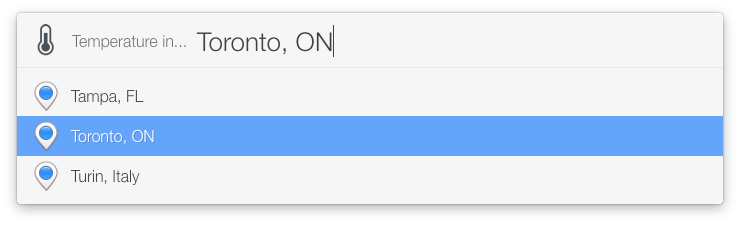
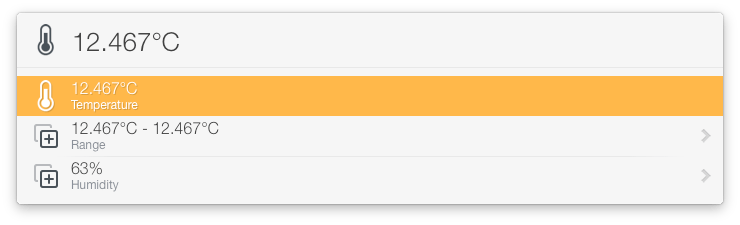

# Temperature in...

Retrieves the temperature at the location you specify. It accepts addresses, zip
codes, and country and/or city names.

Run it without text and it will list the temperatures at preset locations:

It keeps a history of all locations you've looked up previously and will suggest
them as you type.

_Note: Results are cached. To clear it, hold down shift while running._

## Set your preset locations

Hold down ctrl when you run the action and it'll return its Preferences.plist
file. Add your locations to the "locations" key.

## Requirements

«Temperature In» works out of the box by using a shared API key. If you're
getting API query limit errors you'll need to get a (free) API key from
openweathermap.org.

Set the api_key field in Preferences.plist to your API key.
