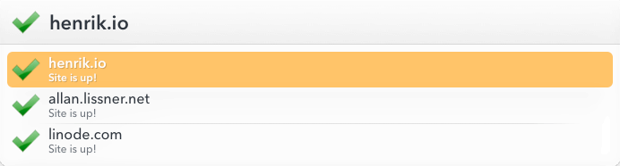

# Site Status

Checks downforeveryoneorjustme.com to see if a website is up or down (or if it's just
you).

;
;
;

You can set a list of pre-set sites to check when you run Site Status without any input:

;

Notes:
 * Hold down ctrl while invoking this action to select this action's Preferences.plist
 * Takes multiple domains (separated by newlines)
