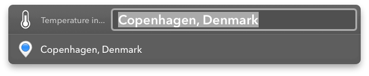
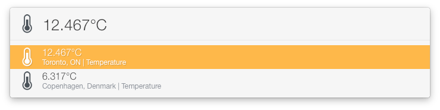

# Temperature in...

Get's the temperature at a location; feed it an address, city, country--whatever.

Run it without text and it will list the temperatures at preset locations: 

Keeps a history of all the locations you've looked up and will suggest them as you type.

Note:
* Hold down shift to ignore & clear the cache
* Hold down ctrl to select this action's Preferences.plist

## Requirements

«Temperature In» works out of the box **without** an API key, but if you're getting API
query limit errors, set the api_key field in Preferences.plist to your openweathermap.org
API key.
